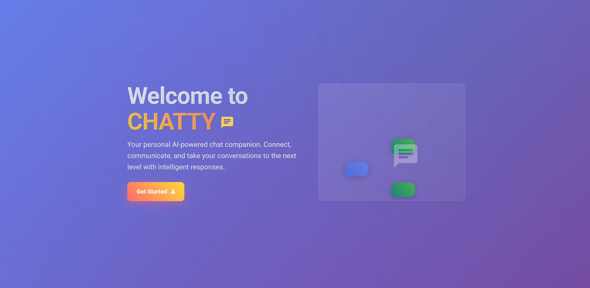
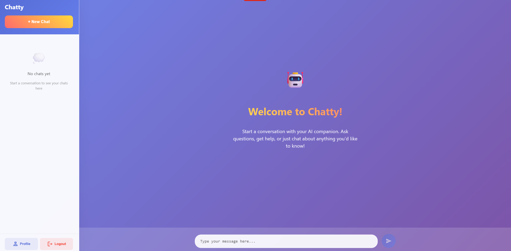
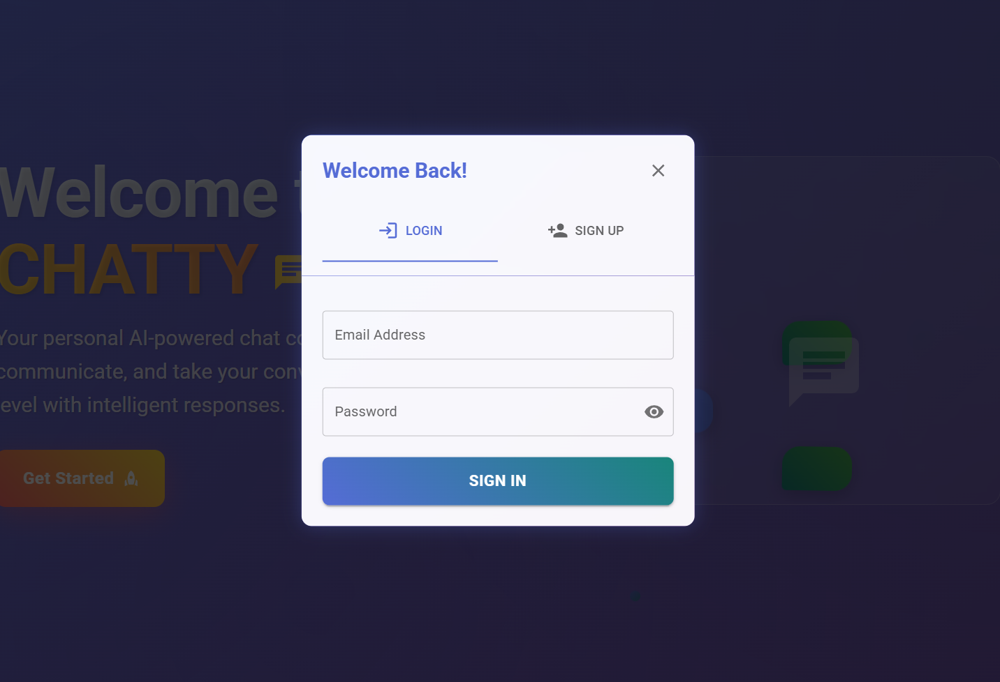
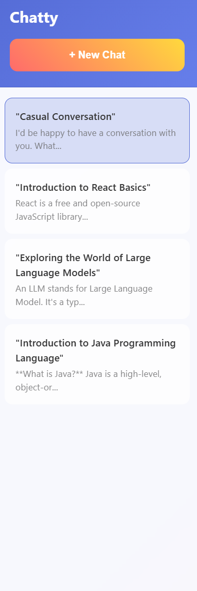
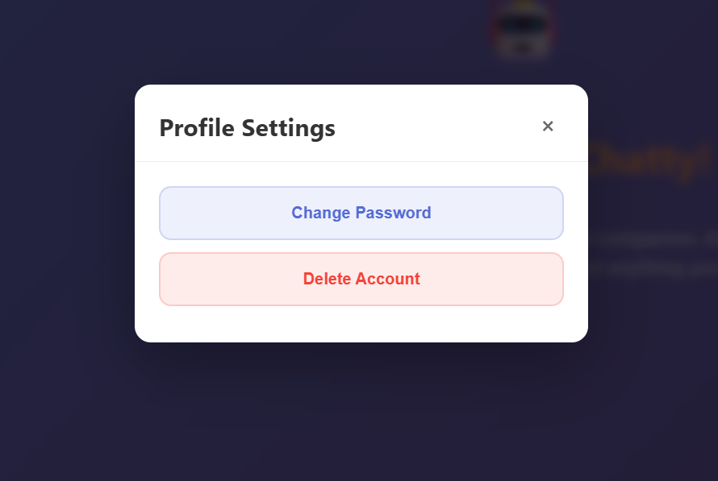

# Chatty - AI-Powered Chat Application

A modern full-stack chat application that allows users to have conversations with AI assistants. Built with Spring Boot backend and React frontend, featuring JWT authentication, real-time messaging, and integration with LLM APIs.




## 🌟 App-Overview & Features

- **AI-Powered Conversations**: Chat with intelligent AI assistants using OpenAI or compatible APIs



- **User Authentication**: Secure JWT-based authentication system



- **Real-time Chat Interface**: Modern, responsive chat UI with typing indicators
- **Auto-generated Chat Titles**: AI generates descriptive titles for conversations
- **Chat History**: Persistent chat sessions with message history




- **Profile Management**: User profile settings and password management




## 🛠️ Technology Stack

### Backend (Spring Boot)
- **Java 17+** - Programming language
- **Spring Boot 3.x** - Application framework
- **Spring Security** - Authentication and authorization
- **Spring Data JPA** - Data persistence layer
- **PostgreSQL** - Primary database
- **JWT** - Token-based authentication
- **WebClient** - HTTP client for LLM API calls
- **Maven** - Dependency management

### Frontend (React + Vite)
- **React 18** - UI framework
- **Material-UI (MUI)** - Component library
- **React Router** - Client-side routing
- **Axios** - HTTP client
- **CSS3 with Animations** - Styling and effects
- **Vite** - Build tool and development server

### Infrastructure
- **Docker** - Containerization
- **Docker Compose** - Multi-container orchestration
- **Nginx** - Web server for frontend


## 📁 Project Structure

```
chatty/
├── chatty-backend/                 # Spring Boot Backend
│   ├── src/main/java/org/chattyproject/
│   │   ├── config/                 # Configuration classes
│   │   │   ├── SecurityConfig.java # Security & CORS configuration
│   │   │   └── LlmConfig.java     # LLM API configuration
│   │   ├── controllers/           # REST Controllers
│   │   │   ├── AuthController.java
│   │   │   ├── ChatController.java
│   │   │   ├── MessageController.java
│   │   │   └── UserController.java
│   │   ├── dtos/                  # Data Transfer Objects
│   │   ├── models/                # JPA Entities
│   │   │   ├── User.java
│   │   │   ├── Chat.java
│   │   │   └── Message.java
│   │   ├── repositories/          # Data Access Layer
│   │   │   ├── UserRepository.java
│   │   │   ├── ChatRepository.java
│   │   │   └── MessageRepository.java
│   │   ├── services/              # Business Logic
│   │   │   ├── AuthService.java
│   │   │   ├── UserService.java
│   │   │   ├── ChatService.java
│   │   │   ├── MessageService.java
│   │   │   └── LlmClient.java
│   │   └── jwt/                   # JWT Utilities
│   ├── Dockerfile
│   └── pom.xml
│
├── chatty-frontend/               # React Frontend
│   ├── public/
│   ├── src/
│   │   ├── api/                   # API Client
│   │   │   ├── base.js           # Axios configuration
│   │   │   ├── authApi.js        # Authentication APIs
│   │   │   ├── chatApi.js        # Chat APIs
│   │   │   └── userApi.js        # User APIs
│   │   ├── pages/                # React Components
│   │   │   ├── ProtectedRoute.jsx  
│   │   ├── pages/                 
│   │   │   ├── LandingPage.jsx   # Home/Login page
│   │   │   └── HomePage.jsx      # Main chat interface
│   │   ├── context/              # React Context
│   │   │   └── AuthContext.jsx   # Authentication context
│   │   ├── App.jsx
│   │   ├── main.jsx
│   │   └── theme.js              # Material-UI theme
│   ├── Dockerfile
│   ├── nginx.conf
│   └── package.json
│
├── docker-compose.yml             # Multi-container setup
├── .env.example                   # Environment variables template
├── init.sql                       # Database initialization
└── README.md
```

## 🔧 Core Components

### Backend Services

#### AuthService
- User registration and authentication
- JWT token generation and validation
- Password encryption with BCrypt

#### ChatService
- Create new chat sessions
- Retrieve user's chat history
- Archive chat functionality
- Integration with LLM for title generation

#### MessageService
- Send and receive messages
- Maintain conversation history
- LLM integration for AI responses

#### LlmClient
- HTTP client for external LLM APIs
- Response processing and error handling
- Configurable model and API endpoints

### Frontend Components

#### LandingPage
- User authentication (login/signup)
- Material-UI modals and forms

#### HomePage
- Main chat interface
- Sidebar with chat history
- Real-time message display
- Profile management modal

#### AuthContext
- Global authentication state
- Token management
- Protected route handling

## 🔐 Security Features

- **JWT Authentication**: Stateless token-based authentication
- **Password Encryption**: BCrypt hashing for secure password storage
- **CORS Configuration**: Controlled cross-origin resource sharing
- **Request Validation**: Input validation using Bean Validation

## 🌐 API Endpoints

### Authentication
- `POST /auth/signup` - User registration
- `POST /auth/login` - User login

### User Management
- `GET /users/profile` - Get current user profile
- `PUT /users/profile` - Update user profile
- `DELETE /users/profile` - Delete user account

### Chat Management
- `GET /chats` - Get user's chats
- `POST /chats` - Create new chat
- `GET /chats/{id}` - Get specific chat

### Messages
- `GET /chats/{chatId}/messages` - Get chat messages
- `POST /chats/{chatId}/messages` - Send message

## 🚀 Getting Started

### Prerequisites
- Java 17+
- Node.js 18+
- Docker & Docker Compose
- LLM API key (OpenAI or compatible)

### Quick Start with Docker
1. **Clone the repository**
   ```bash
   git clone 
   cd chatty
   ```

2. **Set up environment variables**
   ```bash
   cp .env.example .env
   # Edit .env with your API keys and configuration
   ```

3. **Start the application**
   ```bash
   docker-compose up --build
   ```

4. **Access the application**
   - Frontend: http://localhost:5173
   - Backend API: http://localhost:8080

### Local Development

#### Backend Setup
```bash
cd chatty-backend
./mvnw spring-boot:run
```

#### Frontend Setup
```bash
cd chatty-frontend
npm install
npm run dev
```

## 🔧 Configuration

### Environment Variables
```bash
# LLM Configuration
LLM_API_KEY=your-api-key
LLM_API_BASE_URL=https://api.openai.com/v1
LLM_MODEL=gpt-3.5-turbo

# JWT Configuration
JWT_SECRET=your-secret-key
JWT_EXPIRATION=86400000

# Database Configuration
SPRING_DATASOURCE_URL=jdbc:postgresql://localhost:5432/chatty
SPRING_DATASOURCE_USERNAME=chatty_user
SPRING_DATASOURCE_PASSWORD=chatty_password
```

## 🔮 Future Enhancements

- File upload and sharing
- Chat export functionality
- Multiple AI model selection
- Dark/Light theme toggle
- And more...